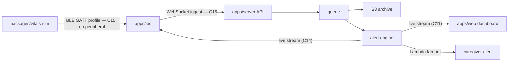
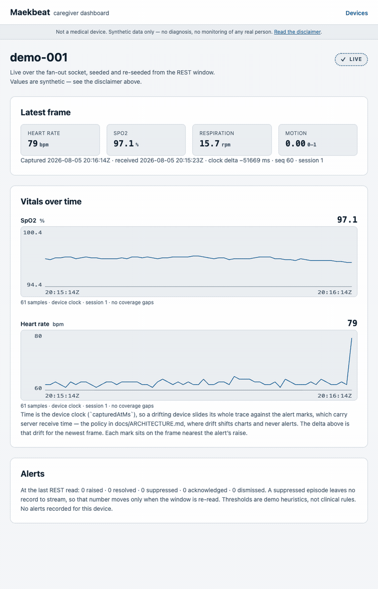

# Maekbeat

**Pronounced "Mac-beat."** From _maek_ (맥), the Korean word for one's pulse.

Wearable-to-caregiver vitals pipeline, end to end: synthetic BLE vitals → SwiftUI iOS app → Node.js/TypeScript API → AWS → live React caregiver dashboard.

[](https://github.com/sebkoo/maekbeat/actions/workflows/ci.yml) [](https://app.codecov.io/gh/sebkoo/maekbeat) [](LICENSE) [](.nvmrc) [](docs/ROADMAP.md) [](DISCLAIMER.md)

**Maekbeat is an educational portfolio project, not a medical device, and uses synthetic data only — see [DISCLAIMER.md](DISCLAIMER.md).**
Out of scope: real medical algorithms · real BLE hardware · protected health information · clinical validation.

<details>
<summary>Not an engineer? The 60-second version</summary>

Imagine a bracelet that counts heartbeats while someone sleeps. Maekbeat is every pipe planned between that bracelet and the family's screen: a fake bracelet (software — packages/vitals-sim, built), a phone app that listens to it, a cloud that stores the numbers, a webpage where a caregiver watches them, and a nudge when the numbers look strange. The bracelet is imaginary, the numbers are invented, and the pipes are being built in the open — the Status board below shows what exists today.

</details>

## Architecture



That diagram is the target architecture, not today's system — the Status board below is what exists. The full design, with latency budgets and failure modes: [docs/ARCHITECTURE.md](docs/ARCHITECTURE.md).

## Design notes

| Topic                                       | Where                                                                                      | Status                          |
| ------------------------------------------- | ------------------------------------------------------------------------------------------ | ------------------------------- |
| BLE→cloud pipeline design                   | [docs/ARCHITECTURE.md](docs/ARCHITECTURE.md) scaling chain + failure modes                 | C4 ✅                           |
| Alert validation without patient data       | synthetic scenarios + golden tests; apps/server tests                                      | C3 ✅ · C8 ✅                   |
| Scaling model and load evidence             | target architecture + k6 results                                                           | C4 ✅ · C19 (planned)           |
| Alert states legible without colour         | tokens + contract test, rendered by apps/web/src/components/AlertTimeline.tsx              | C10 ✅ · C12 ✅                 |
| Missing data drawn as missing               | chart gaps + min/max decimation, pinned in apps/web/src/chart                              | C11 ✅                          |
| Alarm fatigue and acknowledgement           | episode timeline + append-only decision log (apps/server/src/acks.ts)                      | C12 ✅ · C16 ✅ · C21 (planned) |
| Accessibility of a live monitoring UI       | axe + keyboard + live-region scope, [apps/web](apps/web) a11y.test.tsx                     | C12 ✅                          |
| One wire contract, two languages            | Swift decodes the TypeScript goldens, [apps/ios](apps/ios) README                          | C14 ✅                          |
| BLE profile with an MTU budget              | [docs/ble-gatt-profile.md](docs/ble-gatt-profile.md) — 19 bytes of 20                      | C15 ✅                          |
| Testing what has no hardware                | thin adapter over a proved state machine, [apps/ios](apps/ios) README                      | C15 ✅ · C16 ✅ · C17 ✅        |
| Proving the wiring, not just the parts      | composition tests + seeded properties, [apps/ios](apps/ios) test map                       | C12a ✅ · C13 ✅ · C17 ✅       |
| What an alert may say on a lock screen      | banned-word list over the notification body, [apps/ios](apps/ios) README                   | C16 ✅                          |
| Instrumentation before observability        | one trace per frame, parentage asserted by span id (apps/server/src/tracing.shape.test.ts) | C18 ✅ · C19 (planned)          |
| Proving a container is the commit it claims | image label and /healthz revision, both asserted against git ([infra](infra))              | C19 ✅                          |
| Health-data security posture                | [SECURITY.md](SECURITY.md) (today) · docs/security/threat-model.md                         | C22 (planned)                   |
| iOS background execution + BLE lifecycle    | five-phase machine + background notes, [apps/ios](apps/ios) README                         | C15 ✅                          |
| Tooling choices and trade-offs              | [docs/DECISIONS.md](docs/DECISIONS.md) (22 entries today)                                  | C0 ✅                           |
| Process auditability                        | ADRs in docs/adr · PR template + CI hygiene job in .github                                 | C0 ✅                           |

Engineers: start at [docs/ARCHITECTURE.md](docs/ARCHITECTURE.md) · the why: [docs/DECISIONS.md](docs/DECISIONS.md) · the plan: [docs/ROADMAP.md](docs/ROADMAP.md).

## Quickstart

```sh
git clone https://github.com/sebkoo/maekbeat.git && cd maekbeat && ./scripts/bootstrap.sh
```

Or run the whole thing with no toolchain at all: `BUILD_REVISION=$(git rev-parse HEAD) docker compose -f infra/compose.yaml up --build` starts the API and the dashboard in two containers, on <http://127.0.0.1:8080>, with no pnpm and no Node installed ([infra/README.md](infra/README.md)).

[scripts/bootstrap.sh](scripts/bootstrap.sh) verifies the toolchain and activates the .githooks. The pipeline is runnable since C6: `pnpm --filter @maekbeat/server demo` streams simulator frames over WebSocket into [apps/server](apps/server), raises and resolves a demo alert on the anomaly scenario (C7), pushes the same frames to a subscribed dashboard socket (C11), and reads it all back over REST.

## Demo



Captured from the running system by [apps/web/scripts/capture-demo.mjs](apps/web/scripts/capture-demo.mjs) — a real apps/server, a production build of the dashboard, real vitals-sim anomaly frames over a real WebSocket, and a real click on the acknowledgement control. Regenerate it with `pnpm --filter @maekbeat/web demo:gif`; it needs ffmpeg and Chrome, whose path defaults to the macOS location and is overridable with `CHROME_PATH`.

Read no timing off it, and the numbers are measured rather than asserted — the script writes them to [docs/demo/preview.caption.txt](docs/demo/preview.caption.txt) at capture time. This recording is 32 frames sampled every 500 ms and played at 10 fps, so 3.2 seconds of GIF covers 140 seconds of simulated device time: about 44x, averaged over the whole clip.

The clock delta on screen is part of the same artefact. The simulator replays one second of device time every 100 ms, so `receivedAtMs − capturedAtMs` falls by 900 ms per frame and ends deeply negative; it is the replay speed showing through, not a latency this system has. Real latency is C19's to measure.

## Repository tour

```text
apps/        server (WS ingest · ring buffer · alert engine · REST reads · fan-out · decisions · tracing · build identity — C5–C19)
             web (tokens · live chart · timeline · acknowledgement · WCAG 2.2 AA · e2e smoke — C10–C19)
             ios (SwiftUI · golden-decode contract · BLE state machine · gateway uplink · notifications — C14–C17)
packages/    protocol (shared vitals contract: types + zod schemas)
             vitals-sim (deterministic synthetic vitals: rest, motion, anomaly)
infra/       server + web images, compose stack, image and stack proofs — C19; AWS CDK stacks — planned, C19
docs/        adr · ai · regulatory · demo · ROADMAP.md · DECISIONS.md · ble-gatt-profile.md
.githooks/   pre-commit formatting · commit-msg trailer + Conventional Commit checks
.github/     CI workflows · PR template
scripts/     bootstrap + hygiene checks
```

## Status

| Phase                    | Ships                                                                                                                                         | Status | Commits                                                                                                                                                                                                                                                                                                                                                                                                                                                                      |
| ------------------------ | --------------------------------------------------------------------------------------------------------------------------------------------- | ------ | ---------------------------------------------------------------------------------------------------------------------------------------------------------------------------------------------------------------------------------------------------------------------------------------------------------------------------------------------------------------------------------------------------------------------------------------------------------------------------- |
| 1 — Foundations          | toolchain, guardrails, docs harness — foundation commit — application code intentionally starts at C1; see [docs/ROADMAP.md](docs/ROADMAP.md) | ✅     | [C0](https://github.com/sebkoo/maekbeat/commits/main)                                                                                                                                                                                                                                                                                                                                                                                                                        |
| 2 — Contract & simulator | zod schemas, vitals-sim, golden tests, architecture doc                                                                                       | ✅     | [C1 protocol](https://github.com/sebkoo/maekbeat/commit/63be391) · [C2 vitals-sim](https://github.com/sebkoo/maekbeat/commit/01b9007) · [C3 goldens](https://github.com/sebkoo/maekbeat/commit/6ba9c91) · [C4 architecture](https://github.com/sebkoo/maekbeat/commit/aa568a5)                                                                                                                                                                                               |
| 3 — Server               | Fastify, WS ingest, alert engine, tests, coverage gate                                                                                        | ✅     | [C5 skeleton](https://github.com/sebkoo/maekbeat/commit/d352705) · [C6 ingest](https://github.com/sebkoo/maekbeat/commit/0170638) · [C7 alerts](https://github.com/sebkoo/maekbeat/commit/2a1d563) · [C8 tests](https://github.com/sebkoo/maekbeat/commit/2356a62) · [C9 gate](https://github.com/sebkoo/maekbeat/commit/eba4e44) · [C12a retention](https://github.com/sebkoo/maekbeat/commit/5ac4510) · [ratchet raise](https://github.com/sebkoo/maekbeat/commit/f20ccbb) |
| 4 — Web                  | React scaffold, live chart, timeline + ack, tests                                                                                             | ✅     | [C10 tokens](https://github.com/sebkoo/maekbeat/commit/6e9c81c) · [C11 live chart](https://github.com/sebkoo/maekbeat/commit/8dfe023) · [C12 timeline + ack + WCAG](https://github.com/sebkoo/maekbeat/commit/66e30df) · [C13 smoke](https://github.com/sebkoo/maekbeat/commit/18aa597) · [flake repair](https://github.com/sebkoo/maekbeat/commit/4f59d60)                                                                                                                  |
| 5 — iOS                  | SwiftUI scaffold + simulator transport, CoreBluetooth central + gateway, notifications, XCTest                                                | ✅     | [C14 scaffold](https://github.com/sebkoo/maekbeat/commit/ec08ac5) · [C15 BLE + gateway](https://github.com/sebkoo/maekbeat/commit/ad96c2f) · [C16 notifications](https://github.com/sebkoo/maekbeat/commit/dfb105a) · C17 seams + ratchet                                                                                                                                                                                                                                    |
| 6 — Infra & operations   | OTel tracing (C18), Docker + compose, CDK synth-in-CI, k6                                                                                     | ⬜     | C18 tracing · C19 image + compose · CDK synth-in-CI and k6 still to come                                                                                                                                                                                                                                                                                                                                                                                                     |
| 7 — Depth                | intended use, risk register, threat model, SBOM                                                                                               | ⬜     | C20–C22                                                                                                                                                                                                                                                                                                                                                                                                                                                                      |
| 8 — Release              | v0.1.0                                                                                                                                        | ⬜     | C23                                                                                                                                                                                                                                                                                                                                                                                                                                                                          |

Updated in the same commit as every scope change. A commit cannot link itself, so each shipped commit's SHA chip is backfilled by the next commit that touches the board — the one-commit lag is by design.

## Stack

| Layer   | Tools                                                                                                   | Status                                                                                                                                                                       |
| ------- | ------------------------------------------------------------------------------------------------------- | ---------------------------------------------------------------------------------------------------------------------------------------------------------------------------- |
| iOS     | Swift 5.10+, SwiftUI, SwiftLint, XCTest, CoreBluetooth, UserNotifications                               | reads apps/server over REST + WebSocket, implements the BLE central role of a profile no hardware speaks, and notifies locally on its alerts ([apps/ios](apps/ios), C14–C17) |
| Web     | React 19, Vite, TypeScript                                                                              | tokens, live chart, timeline, acknowledgement, WCAG 2.2 AA, e2e smoke ([apps/web](apps/web), C10–C19)                                                                        |
| Server  | Node 22, TypeScript, Fastify, WebSocket, OpenTelemetry                                                  | ingest, alerts, reads, fan-out, decisions, semantic retention, tracing ([apps/server](apps/server), C5–C19)                                                                  |
| Infra   | Docker + compose; AWS CDK: S3, Lambda, ECR, ECS/EC2                                                     | server and web images and the compose stack ([infra](infra), C19); CDK stacks planned, C19                                                                                   |
| Quality | prettier + markdownlint via .githooks; CI hygiene, workspace tests, coverage ratchets, iOS lint + tests | live today, [.github/workflows/ci.yml](.github/workflows/ci.yml)                                                                                                             |

## Why I'm building this

SUDEP kills roughly 1 in 1,000 people with epilepsy per year, mostly unwitnessed during sleep ([CDC](https://www.cdc.gov/epilepsy/sudep/index.html), [Epilepsy Foundation](https://www.epilepsy.com/complications-risks/early-death-sudep)). Seizure-alert wearables are a real regulated product category, not a thought experiment: the Empatica Embrace was cleared by the FDA in 2018, described at clearance as the first smartwatch cleared in neurology. C20 carries that citation alongside the rest of the regulatory reading.

I'm an iOS engineer building that entire class of system — device to dashboard — in public, properly. Maekbeat detects nothing and is cleared by nobody ([DISCLAIMER.md](DISCLAIMER.md)); what it demonstrates is the engineering a system in that category needs. [docs/ROADMAP.md](docs/ROADMAP.md) is the path there.

## How this is built

Built with an AI-assisted workflow under human review — every diff is read, run, and revised before it lands. Process and tooling in [docs/ai/AI_USAGE.md](docs/ai/AI_USAGE.md).

---

The plan: [docs/ROADMAP.md](docs/ROADMAP.md) · contributing: [CONTRIBUTING.md](CONTRIBUTING.md) (good-first-issues arrive at C23) · license: [Apache-2.0](LICENSE).
