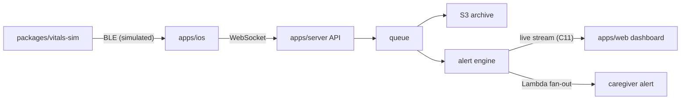

# Maekbeat

**Pronounced "Mac-beat."** From _maek_ (맥), the Korean word for one's pulse.

Wearable-to-caregiver vitals pipeline, end to end: synthetic BLE vitals → SwiftUI iOS app → Node.js/TypeScript API → AWS → live React caregiver dashboard.

[](https://github.com/sebkoo/maekbeat/actions/workflows/ci.yml) [](https://app.codecov.io/gh/sebkoo/maekbeat) [](LICENSE) [](.nvmrc) [](docs/ROADMAP.md) [](DISCLAIMER.md)

**Maekbeat is an educational portfolio project, not a medical device, and uses synthetic data only — see [DISCLAIMER.md](DISCLAIMER.md).**
Out of scope: real medical algorithms · real BLE hardware · protected health information · clinical validation.

<details>
<summary>Not an engineer? The 60-second version</summary>

Imagine a bracelet that counts heartbeats while someone sleeps. Maekbeat is every pipe planned between that bracelet and the family's screen: a fake bracelet (software — packages/vitals-sim, built), a phone app that listens to it, a cloud that stores the numbers, a webpage where a caregiver watches them, and a nudge when the numbers look strange. The bracelet is imaginary, the numbers are invented, and the pipes are being built in the open — the Status board below shows what exists today.

</details>

## Architecture



That diagram is the target architecture, not today's system — the Status board below is what exists. The full design, with latency budgets and failure modes: [docs/ARCHITECTURE.md](docs/ARCHITECTURE.md).

## Design notes

| Topic                                    | Where                                                                      | Status                 |
| ---------------------------------------- | -------------------------------------------------------------------------- | ---------------------- |
| BLE→cloud pipeline design                | [docs/ARCHITECTURE.md](docs/ARCHITECTURE.md) scaling chain + failure modes | C4 ✅                  |
| Alert validation without patient data    | synthetic scenarios + golden tests; apps/server tests                      | C3 ✅ · C8 ✅          |
| Scaling model and load evidence          | target architecture + k6 results                                           | C4 ✅ · C19 (planned)  |
| Alert states legible without colour      | [apps/web](apps/web) tokens + contract test (word · mark · border style)   | C10 ✅ · C12 (planned) |
| Production monitoring                    | OpenTelemetry + dashboards-as-code                                         | C18 (planned)          |
| Health-data security posture             | [SECURITY.md](SECURITY.md) (today) · docs/security/threat-model.md         | C22 (planned)          |
| iOS background execution + BLE lifecycle | apps/ios BLE state machine + background notes                              | C15 (planned)          |
| Tooling choices and trade-offs           | [docs/DECISIONS.md](docs/DECISIONS.md) (12 entries today)                  | C0 ✅                  |
| Process auditability                     | ADRs in docs/adr · PR template + CI hygiene job in .github                 | C0 ✅                  |

Engineers: start at [docs/ARCHITECTURE.md](docs/ARCHITECTURE.md) · the why: [docs/DECISIONS.md](docs/DECISIONS.md) · the plan: [docs/ROADMAP.md](docs/ROADMAP.md).

## Quickstart

```sh
git clone https://github.com/sebkoo/maekbeat.git && cd maekbeat && ./scripts/bootstrap.sh
```

[scripts/bootstrap.sh](scripts/bootstrap.sh) verifies the toolchain and activates the .githooks. The pipeline is runnable since C6: `pnpm --filter @maekbeat/server demo` streams simulator frames over WebSocket into [apps/server](apps/server), raises and resolves a demo alert on the anomaly scenario (C7), and reads it all back over REST.

## Repository tour

```text
apps/        server (WS ingest · ring buffer · alert engine · REST reads · tests + coverage gate — C5–C9)
             web (React scaffold · design tokens · typed API client — C10; live chart — C11) · ios — planned, C14–C17
packages/    protocol (shared vitals contract: types + zod schemas)
             vitals-sim (deterministic synthetic vitals: rest, motion, anomaly)
infra/       AWS CDK stacks — planned, C19
docs/        adr · ai · ROADMAP.md · DECISIONS.md
.githooks/   pre-commit formatting · commit-msg trailer + Conventional Commit checks
.github/     CI workflows · PR template
scripts/     bootstrap + hygiene checks
```

## Status

| Phase                    | Ships                                                                                                                                         | Status | Commits                                                                                                                                                                                                                                                                                                                           |
| ------------------------ | --------------------------------------------------------------------------------------------------------------------------------------------- | ------ | --------------------------------------------------------------------------------------------------------------------------------------------------------------------------------------------------------------------------------------------------------------------------------------------------------------------------------- |
| 1 — Foundations          | toolchain, guardrails, docs harness — foundation commit — application code intentionally starts at C1; see [docs/ROADMAP.md](docs/ROADMAP.md) | ✅     | [C0](https://github.com/sebkoo/maekbeat/commits/main)                                                                                                                                                                                                                                                                             |
| 2 — Contract & simulator | zod schemas, vitals-sim, golden tests, architecture doc                                                                                       | ✅     | [C1 protocol](https://github.com/sebkoo/maekbeat/commit/63be391) · [C2 vitals-sim](https://github.com/sebkoo/maekbeat/commit/01b9007) · [C3 goldens](https://github.com/sebkoo/maekbeat/commit/6ba9c91) · [C4 architecture](https://github.com/sebkoo/maekbeat/commit/aa568a5)                                                    |
| 3 — Server               | Fastify, WS ingest, alert engine, tests, coverage gate                                                                                        | ✅     | [C5 skeleton](https://github.com/sebkoo/maekbeat/commit/d352705) · [C6 ingest](https://github.com/sebkoo/maekbeat/commit/0170638) · [C7 alerts](https://github.com/sebkoo/maekbeat/commit/2a1d563) · [C8 tests](https://github.com/sebkoo/maekbeat/commit/2356a62) · [C9 gate](https://github.com/sebkoo/maekbeat/commit/eba4e44) |
| 4 — Web                  | React scaffold, live chart, timeline + ack, tests                                                                                             | 🔄     | C10 scaffold + tokens · C11–C13                                                                                                                                                                                                                                                                                                   |
| 5 — iOS                  | SwiftUI, CoreBluetooth, notifications, XCTest                                                                                                 | ⬜     | C14–C17                                                                                                                                                                                                                                                                                                                           |
| 6 — Infra & operations   | Docker + compose, OTel, CDK synth-in-CI, k6                                                                                                   | ⬜     | C18–C19                                                                                                                                                                                                                                                                                                                           |
| 7 — Depth                | intended use, risk register, threat model, SBOM                                                                                               | ⬜     | C20–C22                                                                                                                                                                                                                                                                                                                           |
| 8 — Release              | v0.1.0                                                                                                                                        | ⬜     | C23                                                                                                                                                                                                                                                                                                                               |

Updated in the same commit as every scope change. A commit cannot link itself, so each shipped commit's SHA chip is backfilled by the next commit that touches the board — the one-commit lag is by design.

## Stack

| Layer   | Tools                                                               | Status                                                                                   |
| ------- | ------------------------------------------------------------------- | ---------------------------------------------------------------------------------------- |
| iOS     | Swift 5.10+, SwiftUI, CoreBluetooth                                 | planned, C14–C17                                                                         |
| Web     | React 19, Vite, TypeScript                                          | scaffold + design tokens + typed API client live ([apps/web](apps/web), C10)             |
| Server  | Node 22, TypeScript, Fastify, WebSocket                             | ingest + alerts + reads + tests + coverage gate live ([apps/server](apps/server), C5–C9) |
| Infra   | AWS CDK: S3, Lambda, ECR, ECS/EC2; Docker                           | planned, C18–C19                                                                         |
| Quality | prettier + markdownlint via .githooks; CI hygiene + workspace tests | live today, [.github/workflows/ci.yml](.github/workflows/ci.yml)                         |

## Why I'm building this

SUDEP kills roughly 1 in 1,000 people with epilepsy per year, mostly unwitnessed during sleep ([CDC](https://www.cdc.gov/epilepsy/sudep/index.html), [Epilepsy Foundation](https://www.epilepsy.com/complications-risks/early-death-sudep)). Companies like Neurava build wearables against exactly this risk. I'm an iOS engineer building that entire class of system — device to dashboard — in public, properly; [docs/ROADMAP.md](docs/ROADMAP.md) is the path there.

## How this is built

Built with an AI-assisted workflow under human review — every diff is read, run, and revised before it lands. Process and tooling in [docs/ai/AI_USAGE.md](docs/ai/AI_USAGE.md).

---

The plan: [docs/ROADMAP.md](docs/ROADMAP.md) · contributing: [CONTRIBUTING.md](CONTRIBUTING.md) (good-first-issues arrive at C23) · license: [Apache-2.0](LICENSE).
