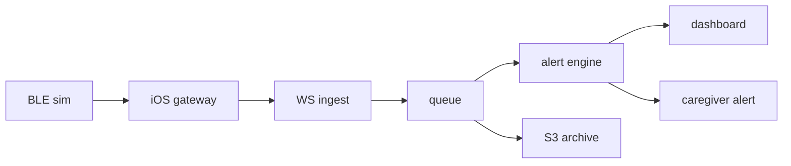
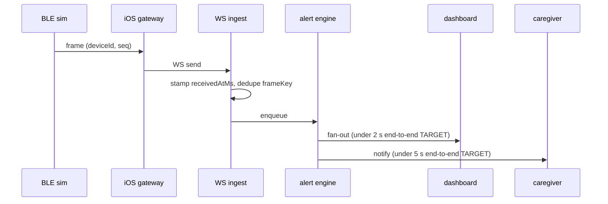
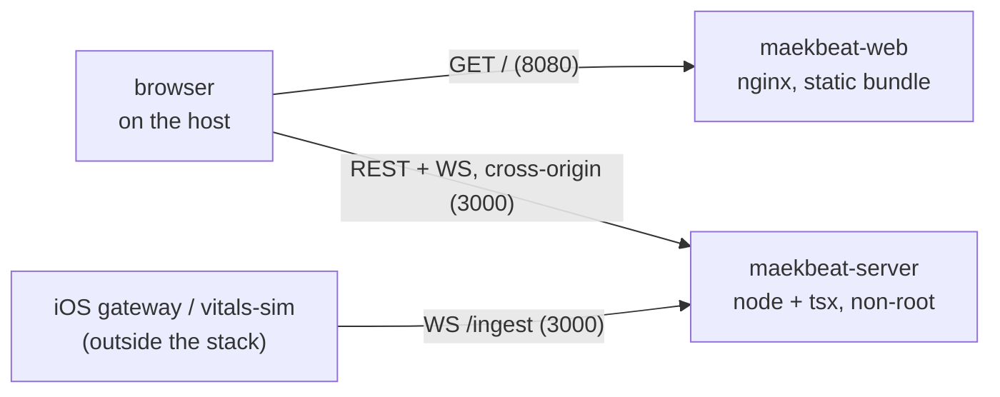

# Architecture

Maekbeat's scaling chain, stage by stage, with the failure modes each stage must answer. Code-backed claims cite the repo path that proves them; every unbuilt stage is labeled "planned — C\<n\>" against [ROADMAP.md](ROADMAP.md). Every latency number here is a TARGET until C19 measures it, and the measurement method sits next to each number so the targets are falsifiable rather than decorative.

## What exists today

Two packages are real: [packages/protocol](../packages/protocol) — the wire contract, a strict zod `vitalsFrameSchema` plus the additive `alertEventSchema` (C7) — and [packages/vitals-sim](../packages/vitals-sim), a deterministic synthetic vitals generator whose exact output is golden-pinned in packages/vitals-sim/golden/. The server in [apps/server](../apps/server) is real through stage 5: WebSocket ingest validating every frame (C6), the in-process ring buffer (C6), and the sliding-window alert engine (C7) — the runnable pipeline apps/server/scripts/demo.ts drives frames to a raised-and-resolved alert end to end. The dashboard exists since C10 ([apps/web](../apps/web)) and streams since C11 — the fan-out socket of apps/server/src/stream.ts pushes each accepted frame and each alert transition to the device page, which seeds from REST and re-reads the window on every reconnect — while the notification stage after it stays planned and carries its commit number in the table below.

## Scaling chain

| #   | Stage                  | Dev form                    | Target form                                                        | Status                                                                                                                                                                                                                                                                     |
| --- | ---------------------- | --------------------------- | ------------------------------------------------------------------ | -------------------------------------------------------------------------------------------------------------------------------------------------------------------------------------------------------------------------------------------------------------------------- |
| 1   | BLE device             | packages/vitals-sim frames  | wearable speaking BLE GATT (hardware out of scope — DISCLAIMER.md) | sim shipped (C2); simulator transport shipped — C14; GATT profile shipped — C15 (docs/ble-gatt-profile.md); no peripheral implements it                                                                                                                                    |
| 2   | iOS gateway            | simulator transport in-app  | CoreBluetooth central, background streaming                        | shipped — C14 (reads the fan-out), C15 (central role + uplink to /ingest), C17 (the app actually starts it); the radio path is untested without hardware — apps/ios/README.md                                                                                              |
| 3   | WebSocket ingestion    | Fastify WS endpoint         | same, horizontally scaled                                          | dev form shipped — C6 (apps/server/src/ingest.ts); NOT horizontally scaled and cannot be until stage 4 lands — the server's state is in process, so infra/cdk synthesizes one task and asserts it                                                                          |
| 4   | Event queue            | in-process ring buffer      | SQS                                                                | ring buffer shipped — C6 (apps/server/src/store.ts); SQS is target architecture, no commit assigned, and infra/cdk omits it deliberately — nothing here produces to a queue                                                                                                |
| 5   | Stream processor       | sliding-window alert engine | same, consuming SQS                                                | dev form shipped — C7 (apps/server/src/alerts.ts); SQS consumption is target                                                                                                                                                                                               |
| 6   | Storage                | ring-buffer window only     | S3 raw archive + time-series read model                            | ring-buffer window shipped — C6; S3 + time-series not built and no commit assigned — infra/cdk omits the archive bucket because no code writes an archive object                                                                                                           |
| 7   | Dashboard fan-out      | WS push to apps/web         | Lambda fan-out                                                     | dev form shipped — C11 (apps/server/src/stream.ts, apps/web); per-subscriber send-buffer bound shipped — C19 (docs/DECISIONS.md #23); idle-socket heartbeat shipped — C19; Lambda fan-out not built and no commit assigned — there is no handler for infra/cdk to point at |
| 8   | Caregiver notification | iOS notification            | same, triggered via fan-out                                        | dev form shipped — C16 (local notifications, apps/ios); an episode raised during a socket outage reaches it since C17; push is not built and no commit assigned                                                                                                            |

Time-series note: the S3 raw archive (planned, no commit assigned) would store frames as NDJSON, whose frame-line serialization is already pinned by the golden fixtures in packages/vitals-sim/golden/ (fixtures additionally carry a header line the archive will not). Whether a dedicated time-series store fronts dashboard history is undecided; until then dev reads come from the ring-buffer window.

## Frame lifecycle

The ingest and processing legs are real since C6–C7 — receivedAtMs stamp and session-scoped dedupe (apps/server/src/ingest.ts, store.ts), the ring buffer as enqueue target, and the alert engine judging each accepted frame (apps/server/src/alerts.ts) — the fan-out leg since C11 (apps/server/src/stream.ts), gateway transport since C14–C15, and the notification leg since C16 (apps/ios). Both TARGETs are end-to-end paths, defined precisely in the budget table below, not budgets for the single leg they annotate.

## Where the spans sit (C18)

The server is instrumented, not observable: apps/server emits OpenTelemetry spans, and this repository deploys no collector and stands up no backend. What exists is the trace structure the C19 measurement will read.

One trace per ingest message — not per accepted frame: the root span opens before validation, so a malformed frame and a duplicate each produce a trace too, which is the point, since "why did nothing arrive" is answered by the frames that were refused. It covers the server's share of the lifecycle above — stages 3 through 7, from the WebSocket message to the fan-out publish. It does not span the device, the gateway or the dashboard: nothing upstream propagates trace context, so `ingest.frame` is a root rather than a claimed child of a phone.

| Span               | Parent           | Pipeline stage                            |
| ------------------ | ---------------- | ----------------------------------------- |
| `ingest.frame`     | none (root)      | 3 — WebSocket ingestion                   |
| `ingest.validate`  | `ingest.frame`   | 3 — `vitalsFrameSchema` parse             |
| `store.ingest`     | `ingest.frame`   | 4 — ring buffer, dedupe and session epoch |
| `alert.evaluate`   | `ingest.frame`   | 5 — sliding-window engine over one frame  |
| `alert.transition` | `alert.evaluate` | 5 — one per raise or resolve              |
| `stream.fanout`    | `ingest.frame`   | 7 — dashboard publish                     |

Parentage is passed explicitly at each call rather than read from an ambient context, and apps/server/src/tracing.shape.test.ts asserts it by span id over a golden replay. Stage 6 (S3 archive) and stage 8 (notification) carry no span because neither exists in the server; the notification-dispatch span the budget table below names is future work, and the trace stops at the fan-out publish until it lands.

Attributes: deviceId, seq, session epoch, the duplicate and out-of-order flags, the ingest outcome, the validate and store results, the transition count, and per alert its id, lifecycle state, metric and direction. No reading value enters a span. The rule is "never a measured value" rather than "identifiers only", because an alert span names the rule that fired and therefore does say a device had a low-SpO2 episode — that is the alert itself, and the trade is recorded in docs/DECISIONS.md #20.

## How it runs: container topology (C19)

`docker compose -f infra/compose.yaml up --build` starts two containers and nothing else is needed on the machine. `maekbeat-server` is the API of stages 3 through 7, listening on 127.0.0.1:3000. `maekbeat-web` is unprivileged nginx over the `vite build` output, on 127.0.0.1:8080.

The two containers never talk to each other. There is no reverse proxy in front of them, so the browser reaches the API across an origin boundary exactly as it does in development, and the server's `CORS_ORIGIN` names the web origin explicitly — the crossing the C13 smoke exists to prove would be erased by a proxy, with the suite still green (docs/DECISIONS.md #21). The consequence is two published ports rather than one, both bound to loopback because this server authenticates nobody.

Both stages build on `node:22.22.0-alpine3.22`, and the package manager is resolved from the repository's own `packageManager` field through corepack before anything installs — so the image is built by pnpm 11.10.0 rather than by whatever a base image happens to carry. Of the arm64 image's 301 MB, about 118 MB is the Node binary and 60 MB the server's production dependencies, which makes image size a base-image question; the candidates and the reason none is taken yet are in [infra/README.md](../infra/README.md).

The image is the server. apps/web is a static bundle whose deployment target is an S3 origin behind a CDN, so the web container exists to run the smoke and is not a production artifact — nothing in infra/nginx.conf may grow a runtime. Configuration reaches the server through the environment only, and `BUILD_REVISION` is required under `NODE_ENV=production`: an image that cannot name its commit cannot be caught serving a stale layer, which is C13's stale-bundle lesson one layer down. That value is the image's `org.opencontainers.image.revision` label and the `revision` field on `/healthz`, and infra/compose-smoke.sh asserts both against `git rev-parse HEAD`.

The host that builds is arm64 and the deploy target is x86-64. `docker build` on an Apple Silicon machine produces an arm64 image and says nothing about it, and that image cannot execute on the target at all — so the deploy-target build passes `--platform linux/amd64` and infra/verify-image.sh asserts the built artifact's architecture and then makes it run and report `process.arch` (docs/DECISIONS.md #22). Anyone cloning this on an x86-64 Linux machine gets the same two images from the same commands; what changes is only which of the two builds is the emulated one. Measured build times and image sizes, with the runtime named, are in [infra/README.md](../infra/README.md).

## The AWS form of the same stack — synthesized, never deployed

**The template in [infra/cdk](../infra/cdk) has never been applied to an AWS account.** It is generated by `cdk synth` and asserted by a test suite that runs with no credentials; no stack has ever been created from it, and no number in this repository was measured on AWS.

What it claims is a correspondence, one resource at a time, between the compose stack above and the AWS one below. Each row names the thing that exists today.

| Compose service or property           | AWS form                                                        |
| ------------------------------------- | --------------------------------------------------------------- |
| `maekbeat-server` image               | ECR repository, tagged with `BUILD_REVISION`                    |
| `server` service and its environment  | ECS Fargate task definition and service (docs/DECISIONS.md #25) |
| published port `127.0.0.1:3000:3000`  | internet-facing ALB, HTTPS listener, IP target group            |
| container `HEALTHCHECK` on `/healthz` | target-group health check on the same path                      |
| pino stdout, read with `docker logs`  | CloudWatch log group                                            |
| `web` service and its bundle          | S3 bucket behind CloudFront, private via Origin Access Control  |
| the compose network                   | VPC, two availability zones, one NAT gateway                    |

Three stages of the pipeline above have no AWS form here, and their absence is the point. The SQS queue at stage 4, the S3 raw archive at stage 6 and the Lambda fan-out at stage 7 are all target architecture with no code behind them — the queue is an in-process ring buffer and the fan-out an in-process publisher — so synthesizing them would describe a system nobody can run. `infra/cdk/src/stack.test.ts` asserts they are absent.

Two properties of the AWS form are not present in compose at all, because compose has nothing that could break them. The load balancer's idle timeout must exceed the server's `STREAM_HEARTBEAT_MS`, or every idle dashboard socket is closed on a timer by an intermediary that considers silence to be death; and the dashboard is served over HTTPS by CloudFront, so the API listener must also be HTTPS or the browser blocks every call to it as mixed content. Both are relations between two halves of this repository, so both are asserted rather than described.

## Latency budgets — all TARGETS

| Path                                  | Target    | How C19 measures it                                                                                                                                          |
| ------------------------------------- | --------- | ------------------------------------------------------------------------------------------------------------------------------------------------------------ |
| frame capture → dashboard paint       | under 2 s | k6 drives vitals-sim frames over WS while OpenTelemetry spans (wired at C18) time ingest → queue → fan-out, and the dashboard logs receipt − `capturedAtMs`. |
| anomaly frame → notification dispatch | under 5 s | the same k6 run traces the anomaly frame's ingest span through to the notification-dispatch span, one trace per alert.                                       |

Both keep the word "target", and C19's measurements are the reason they can now say precisely why. The load rig measures the server's leg of the first path — ingest stamp to fan-out delivery, 1 ms at p95 on the machine named in [infra/README.md](../infra/README.md) — and neither end of it: frame capture to dashboard paint additionally spans a device, a phone and a browser render, and the notification-dispatch span of the second path does not exist in this server. A budget is not measured until the whole path is, and reporting one leg as the number would be the more useful-looking of the two mistakes available here.

The load rig itself is a compose service rather than a host tool: `infra/load.sh` runs grafana/k6 on the compose network ([infra/k6.Dockerfile](../infra/k6.Dockerfile), profiles in infra/k6/), so a clone gets it without installing k6. It reports and never gates, and the reason is [docs/DECISIONS.md](DECISIONS.md) #24 — a shared runner's numbers are not comparable run to run, so a CI load gate is a flake generator in a performance costume. What does gate CI is the deterministic half: apps/server/src/load.test.ts and apps/server/src/fanout-bound.test.ts. Scale (device concurrency) still carries no number, because nothing here has measured one honestly; what is measured is that the ingest path's cost tracks device count rather than frame rate at equal throughput.

## Failure modes

| Failure mode              | Owning stage(s)           | Mechanism                                                | Status                                                                                        |
| ------------------------- | ------------------------- | -------------------------------------------------------- | --------------------------------------------------------------------------------------------- |
| duplicate packets         | ingest (3)                | `frameKey` dedupe                                        | shipped — C6 (apps/server/src/store.ts, session-scoped)                                       |
| delayed / out-of-order    | ingest (3), processor (5) | identity never by time; order by (capturedAtMs, seq)     | shipped — C6 (read ordering), C7 (receive-time windows)                                       |
| clock drift               | ingest (3), processor (5) | `receivedAtMs − capturedAtMs` delta; server-time windows | shipped — C6 (stamping), C7 (windows on receive time)                                         |
| device disconnect         | ingest (3), gateway (2)   | staleness signal; BLE state machine                      | lastReceivedAtMs shipped — C6; rendered as a chart gap — C11; BLE state machine shipped — C15 |
| offline buffering, replay | gateway (2)               | on-device buffer, replay in seq order, idempotent        | dedupe shipped — C6 (windowed); gateway buffer shipped — C15 (bounded, resumes from last ack) |

The bound that stage 7 was missing is closed as of C19, and the measurement is what closed it. `socket.send()` queued into the `ws` buffer with no cap and nothing read `bufferedAmount`, so a dashboard on a poor connection grew this process's memory for as long as it stayed attached — the only client-driven growth in the system, where the ring buffer, alert history, dedupe set and inbound payload each carry a documented number. A stalled subscriber was measured holding 12.1 MB against 12.7 MB published over 60 000 frames, at 211 bytes per fan-out message, which is roughly 18 MB a day per stalled dashboard at 1 Hz.

The bound is `STREAM_MAX_BUFFERED_BYTES`, 256 KiB per subscriber — one default ring's worth, because past that a subscriber gains nothing by staying attached: reconnecting back-fills the whole ring over REST and anything older is already evicted. At the bound the subscriber is dropped with close code 1013 rather than having its messages discarded, since a stream that skips frames and stays open produces gaps no client can render — the C11 rule and the C17 alert-shaped hole, both broken from the server side. Recorded as docs/DECISIONS.md #23, pinned in apps/server/src/fanout-bound.test.ts, and detailed in apps/server/README.md.

The stages absent from the owning column answer by construction. The simulator (1) emits strictly monotonic `seq` and synthetic tick time, so it cannot itself produce duplicates, reordering, or drift — pinned by the golden fixtures in packages/vitals-sim/golden/ — while queue, storage, fan-out, and notification (4, 6, 7, 8) consume frames only after ingest has deduplicated and receive-stamped them, so all five modes are resolved upstream of their input. What those downstream stages still owe — delivery latency under load — is exactly what the C19 k6 profile measures.

### Duplicate packets

Frame identity is `frameKey` = (deviceId, seq), shipped in [packages/protocol/src/vitals.ts](../packages/protocol/src/vitals.ts); since C6, ingest keeps the first frame per key within a server-side session ([apps/server/src/store.ts](../apps/server/src/store.ts)), so in-session retries and replays become no-ops. The reboot caveat is resolved: a `seq` regression past the 64-frame reorder window starts a new session epoch, per the decision in [docs/DECISIONS.md](DECISIONS.md) #11 with residual limits recorded in [packages/protocol/README.md](../packages/protocol/README.md). The C15 BLE reconnect work exercises it for real.

### Delayed and out-of-order packets

A frame's identity never depends on when it arrives — `frameKey` excludes timestamps by design (packages/protocol/README.md). Ordering is (`capturedAtMs`, `seq`): the ring buffer stores frames in arrival order and REST reads sort at query time (apps/server/src/store.ts), so a late arrival inside the 64-frame reorder window is accepted once and lands in capture order. The C7 sliding window (apps/server/src/alerts.ts) counts every accepted frame at its receive time — a late frame inside the window still contributes, and the dedupe upstream guarantees it contributes once.

### Clock drift

The wire carries one timestamp, `capturedAtMs`, from the device clock, deliberately without a contract-level freshness bound ([packages/protocol/src/vitals.ts](../packages/protocol/src/vitals.ts)). The handling this document fixed now runs end to end: the server stamps `receivedAtMs` per frame at ingest ([apps/server/src/ingest.ts](../apps/server/src/ingest.ts)), the `receivedAtMs − capturedAtMs` delta is the drift signal, and the alert windows evaluate on server receive time ([apps/server/src/alerts.ts](../apps/server/src/alerts.ts), no clock inside the engine) — a drifting device clock can shift a chart, never an alert. `frameKey` excludes both timestamps, so drift cannot change a frame's identity.

### Device disconnect

The server side shipped at C6 as a signal, not a verdict: GET /devices exposes `lastReceivedAtMs` per device ([apps/server/src/reads.ts](../apps/server/src/reads.ts)), and sessions survive WS reconnects by design; C11 renders that silence rather than papering over it, breaking the chart line across a run of missing samples and shading it as a coverage gap ([apps/web/src/chart/geometry.ts](../apps/web/src/chart/geometry.ts)) while the dashboard's own socket state sits beside the data it explains. C15 shipped the BLE side: the five-phase machine (disconnected → connecting → connected → streaming → recovering) in apps/ios, with every transition and every rejected transition asserted, and `recovering` kept distinct from `connecting` because only one of them means readings are being missed now. A stall deadline covers the case a disconnect does not — notifications stopping while the link stays up. What none of it has is a radio to run against; the boundary between what CI verifies and what needs a device is tabulated in apps/ios/README.md.

### Offline buffering and replay

The gateway half shipped at C15: frames buffer on-device while the uplink is down, bounded at 1024 with the oldest dropped and counted, and a reconnect resends the tail rather than the session — the acknowledged mark survives the socket, only the in-flight mark is cleared. Checked against a real apps/server rather than against this paragraph (apps/ios `GatewayIntegrationTests`), which is how the residual limit was found to be worse than recorded: an in-window reboot never reaches the server at all, because the gateway refuses to resend at or below its last ack. The server half is live: C6 ingest dedupes replays within the 64-frame reorder window (apps/server/src/store.ts), which binds the C15 gateway to resume from its last delivered `seq` rather than replaying whole sessions — the constraint recorded in packages/protocol/README.md and docs/DECISIONS.md #11.

## Measurement plan

OpenTelemetry tracing shipped at C18 (see "Where the spans sit" above); the container image, compose stack, dashboards-as-code in infra/ and the k6 load profile all land at C19; from C19 on, measured numbers replace every TARGET label in this document and the README, per the [ROADMAP.md](ROADMAP.md) rule. Until then, any latency claim quoted from this file must carry the word "target".
