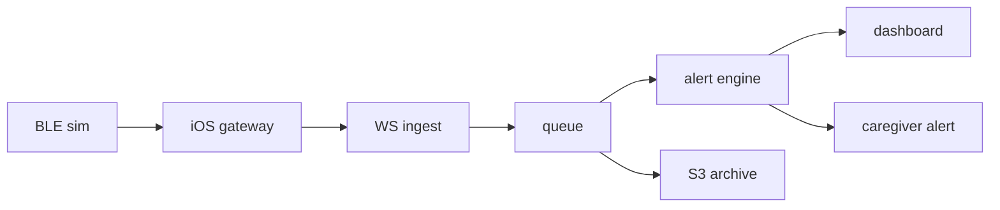
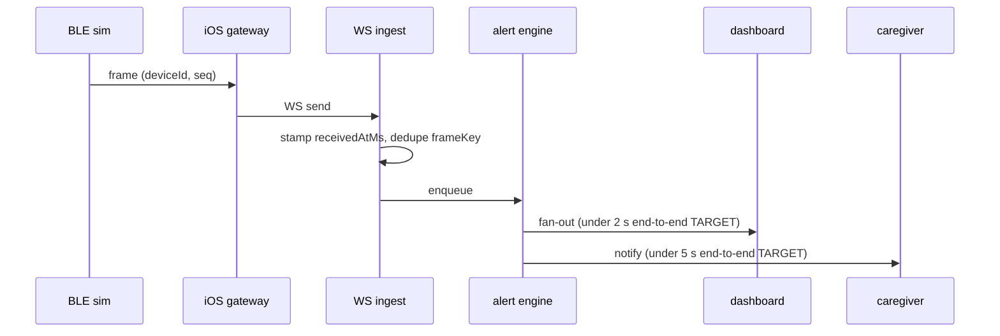

# Architecture

Maekbeat's scaling chain, stage by stage, with the failure modes each stage must answer. Code-backed claims cite the repo path that proves them; every unbuilt stage is labeled "planned — C\<n\>" against [ROADMAP.md](ROADMAP.md). Every latency number here is a TARGET until C19 measures it, and the measurement method sits next to each number so the targets are falsifiable rather than decorative.

## What exists today

Two packages are real: [packages/protocol](../packages/protocol) — the wire contract, a strict zod `vitalsFrameSchema` with transport-validity bounds and the `frameKey` identity — and [packages/vitals-sim](../packages/vitals-sim), a deterministic synthetic vitals generator whose exact output is golden-pinned in packages/vitals-sim/golden/. Everything downstream of the simulator is planned and carries its commit number in the table below.

## Scaling chain

| #   | Stage                  | Dev form                    | Target form                                                        | Status                                                                     |
| --- | ---------------------- | --------------------------- | ------------------------------------------------------------------ | -------------------------------------------------------------------------- |
| 1   | BLE device             | packages/vitals-sim frames  | wearable speaking BLE GATT (hardware out of scope — DISCLAIMER.md) | sim shipped (C2); simulator transport planned — C14; BLE GATT doc — C15    |
| 2   | iOS gateway            | simulator transport in-app  | CoreBluetooth central, background streaming                        | planned — C14–C15                                                          |
| 3   | WebSocket ingestion    | Fastify WS endpoint         | same, horizontally scaled                                          | planned — C6 (Fastify skeleton at C5)                                      |
| 4   | Event queue            | in-process ring buffer      | SQS                                                                | planned — C6 (ring buffer); SQS is target architecture, no commit assigned |
| 5   | Stream processor       | sliding-window alert engine | same, consuming SQS                                                | planned — C7                                                               |
| 6   | Storage                | ring-buffer window only     | S3 raw archive + time-series read model                            | planned — C6, C19                                                          |
| 7   | Dashboard fan-out      | WS push to apps/web         | Lambda fan-out                                                     | planned — C11, C19                                                         |
| 8   | Caregiver notification | iOS notification            | same, triggered via fan-out                                        | planned — C16, C19                                                         |

Time-series note: the S3 raw archive (planned — C19) stores frames as NDJSON, whose frame-line serialization is already pinned by the golden fixtures in packages/vitals-sim/golden/ (fixtures additionally carry a header line the archive will not). Whether a dedicated time-series store fronts dashboard history is a C19 decision, made after the k6 profile shows the real read pattern; until then dev reads come from the ring-buffer window.

## Frame lifecycle

Every leg of this diagram is unbuilt — gateway transport C14–C15, ingest (receivedAtMs stamp, frameKey dedupe) and enqueue C6, dashboard fan-out C11, notification C16; only the frame itself exists today (packages/vitals-sim). Both TARGETs are end-to-end paths, defined precisely in the budget table below, not budgets for the single leg they annotate.

## Latency budgets — all TARGETS

| Path                                  | Target    | How C19 measures it                                                                                                                                          |
| ------------------------------------- | --------- | ------------------------------------------------------------------------------------------------------------------------------------------------------------ |
| frame capture → dashboard paint       | under 2 s | k6 drives vitals-sim frames over WS while OpenTelemetry spans (wired at C18) time ingest → queue → fan-out, and the dashboard logs receipt − `capturedAtMs`. |
| anomaly frame → notification dispatch | under 5 s | the same k6 run traces the anomaly frame's ingest span through to the notification-dispatch span, one trace per alert.                                       |

Neither number has been measured; both are budget targets per [ROADMAP.md](ROADMAP.md), and measured values replace them at C19. Scale (device concurrency) carries no number at all until the C19 k6 profile defines and measures one.

## Failure modes

| Failure mode              | Owning stage(s)           | Mechanism                                                | Status                                       |
| ------------------------- | ------------------------- | -------------------------------------------------------- | -------------------------------------------- |
| duplicate packets         | ingest (3)                | `frameKey` dedupe                                        | key shipped — packages/protocol; dedupe — C6 |
| delayed / out-of-order    | ingest (3), processor (5) | identity never by time; order by (capturedAtMs, seq)     | contract shipped — C1; handling — C6/C7      |
| clock drift               | ingest (3), processor (5) | `receivedAtMs − capturedAtMs` delta; server-time windows | policy fixed here; stamping — C6             |
| device disconnect         | ingest (3), gateway (2)   | stale-stream marking; BLE state machine                  | planned — C6, C15                            |
| offline buffering, replay | gateway (2)               | on-device buffer, replay in seq order, idempotent        | planned — C15; idempotency key shipped — C1  |

The stages absent from the owning column answer by construction. The simulator (1) emits strictly monotonic `seq` and synthetic tick time, so it cannot itself produce duplicates, reordering, or drift — pinned by the golden fixtures in packages/vitals-sim/golden/ — while queue, storage, fan-out, and notification (4, 6, 7, 8) consume frames only after ingest has deduplicated and receive-stamped them, so all five modes are resolved upstream of their input. What those downstream stages still owe — delivery latency under load — is exactly what the C19 k6 profile measures.

### Duplicate packets

Frame identity is `frameKey` = (deviceId, seq), shipped in [packages/protocol/src/vitals.ts](../packages/protocol/src/vitals.ts); ingest keeps the first frame per key (planned — C6), so retries and replays become no-ops. Known caveat: a device reboot that resets `seq` to 0 collides with earlier keys. Whether the dedupe scope gains a session/boot id or treats `seq` regression as a new session is the C6 decision recorded in [packages/protocol/README.md](../packages/protocol/README.md), exercised for real by the C15 BLE reconnect work.

### Delayed and out-of-order packets

A frame's identity never depends on when it arrives — `frameKey` excludes timestamps by design (packages/protocol/README.md). Ordering is (`capturedAtMs`, `seq`): display sorts by capture time with `seq` as the per-device tiebreak, and the C7 sliding window must accept late frames that fall inside its window while the dedupe above guarantees each is counted once. Handling is planned — C6/C7; the contract that makes it possible shipped at C1.

### Clock drift

The wire carries one timestamp, `capturedAtMs`, from the device clock, deliberately without a contract-level freshness bound ([packages/protocol/src/vitals.ts](../packages/protocol/src/vitals.ts)). This document fixes the handling: the server stamps its own `receivedAtMs` per frame at ingest (planned — C6), the `receivedAtMs − capturedAtMs` delta is the drift signal, and the C7 alert windows evaluate on server receive time — a drifting device clock can shift a chart, never an alert. `frameKey` excludes both timestamps, so drift cannot change a frame's identity.

### Device disconnect

Planned, plainly: C6 owns the server side (WS session teardown and stale-stream marking so the dashboard shows silence instead of stale numbers), and C15 owns the BLE side with the state machine documented in apps/ios/README at that commit (disconnected → connecting → connected → streaming → recovering). The simulator is a pure generator ([packages/vitals-sim](../packages/vitals-sim)); transport-level disconnect simulation arrives with the C14 simulator transport.

### Offline buffering and replay

Planned — C15: the gateway buffers frames on-device while offline and replays them in `seq` order on reconnect. Replay becomes idempotent once C6 ingest dedupes on `frameKey` — the key itself already ships in packages/protocol — and the out-of-order handling above absorbs late-arriving history.

## Measurement plan

OpenTelemetry wiring lands at C18 (Docker, compose, dashboards-as-code in infra/) and the k6 load profile at C19; from C19 on, measured numbers replace every TARGET label in this document and the README, per the [ROADMAP.md](ROADMAP.md) rule. Until then, any latency claim quoted from this file must carry the word "target".
