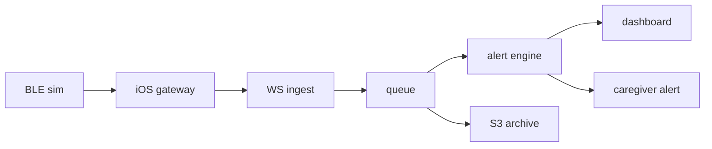
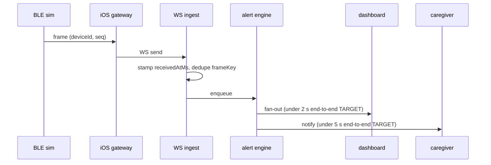

# Architecture

Maekbeat's scaling chain, stage by stage, with the failure modes each stage must answer. Code-backed claims cite the repo path that proves them; every unbuilt stage is labeled "planned — C\<n\>" against [ROADMAP.md](ROADMAP.md). Every latency number here is a TARGET until C19 measures it, and the measurement method sits next to each number so the targets are falsifiable rather than decorative.

## What exists today

Two packages are real: [packages/protocol](../packages/protocol) — the wire contract, a strict zod `vitalsFrameSchema` plus the additive `alertEventSchema` (C7) — and [packages/vitals-sim](../packages/vitals-sim), a deterministic synthetic vitals generator whose exact output is golden-pinned in packages/vitals-sim/golden/. The server in [apps/server](../apps/server) is real through stage 5: WebSocket ingest validating every frame (C6), the in-process ring buffer (C6), and the sliding-window alert engine (C7) — the runnable pipeline apps/server/scripts/demo.ts drives frames to a raised-and-resolved alert end to end. The dashboard exists since C10 ([apps/web](../apps/web)) and streams since C11 — the fan-out socket of apps/server/src/stream.ts pushes each accepted frame and each alert transition to the device page, which seeds from REST and re-reads the window on every reconnect — while the notification stage after it stays planned and carries its commit number in the table below.

## Scaling chain

| #   | Stage                  | Dev form                    | Target form                                                        | Status                                                                                                                                |
| --- | ---------------------- | --------------------------- | ------------------------------------------------------------------ | ------------------------------------------------------------------------------------------------------------------------------------- |
| 1   | BLE device             | packages/vitals-sim frames  | wearable speaking BLE GATT (hardware out of scope — DISCLAIMER.md) | sim shipped (C2); simulator transport shipped — C14; BLE GATT doc — C15                                                               |
| 2   | iOS gateway            | simulator transport in-app  | CoreBluetooth central, background streaming                        | dev form shipped — C14 (apps/ios, reads the fan-out); CoreBluetooth — C15                                                             |
| 3   | WebSocket ingestion    | Fastify WS endpoint         | same, horizontally scaled                                          | dev form shipped — C6 (apps/server/src/ingest.ts); scaling — C19                                                                      |
| 4   | Event queue            | in-process ring buffer      | SQS                                                                | ring buffer shipped — C6 (apps/server/src/store.ts); SQS is target architecture, no commit assigned                                   |
| 5   | Stream processor       | sliding-window alert engine | same, consuming SQS                                                | dev form shipped — C7 (apps/server/src/alerts.ts); SQS consumption is target                                                          |
| 6   | Storage                | ring-buffer window only     | S3 raw archive + time-series read model                            | ring-buffer window shipped — C6; S3 + time-series — C19                                                                               |
| 7   | Dashboard fan-out      | WS push to apps/web         | Lambda fan-out                                                     | dev form shipped — C11 (apps/server/src/stream.ts, apps/web); no bound on a slow subscriber — stated limit, C19; Lambda fan-out — C19 |
| 8   | Caregiver notification | iOS notification            | same, triggered via fan-out                                        | planned — C16, C19                                                                                                                    |

Time-series note: the S3 raw archive (planned — C19) stores frames as NDJSON, whose frame-line serialization is already pinned by the golden fixtures in packages/vitals-sim/golden/ (fixtures additionally carry a header line the archive will not). Whether a dedicated time-series store fronts dashboard history is a C19 decision, made after the k6 profile shows the real read pattern; until then dev reads come from the ring-buffer window.

## Frame lifecycle

The ingest and processing legs are real since C6–C7 — receivedAtMs stamp and session-scoped dedupe (apps/server/src/ingest.ts, store.ts), the ring buffer as enqueue target, and the alert engine judging each accepted frame (apps/server/src/alerts.ts) — and the fan-out leg since C11 (apps/server/src/stream.ts), while gateway transport (C14–C15) and notification (C16) remain unbuilt. Both TARGETs are end-to-end paths, defined precisely in the budget table below, not budgets for the single leg they annotate.

## Latency budgets — all TARGETS

| Path                                  | Target    | How C19 measures it                                                                                                                                          |
| ------------------------------------- | --------- | ------------------------------------------------------------------------------------------------------------------------------------------------------------ |
| frame capture → dashboard paint       | under 2 s | k6 drives vitals-sim frames over WS while OpenTelemetry spans (wired at C18) time ingest → queue → fan-out, and the dashboard logs receipt − `capturedAtMs`. |
| anomaly frame → notification dispatch | under 5 s | the same k6 run traces the anomaly frame's ingest span through to the notification-dispatch span, one trace per alert.                                       |

Neither number has been measured; both are budget targets per [ROADMAP.md](ROADMAP.md), and measured values replace them at C19. Scale (device concurrency) carries no number at all until the C19 k6 profile defines and measures one.

## Failure modes

| Failure mode              | Owning stage(s)           | Mechanism                                                | Status                                                                  |
| ------------------------- | ------------------------- | -------------------------------------------------------- | ----------------------------------------------------------------------- |
| duplicate packets         | ingest (3)                | `frameKey` dedupe                                        | shipped — C6 (apps/server/src/store.ts, session-scoped)                 |
| delayed / out-of-order    | ingest (3), processor (5) | identity never by time; order by (capturedAtMs, seq)     | shipped — C6 (read ordering), C7 (receive-time windows)                 |
| clock drift               | ingest (3), processor (5) | `receivedAtMs − capturedAtMs` delta; server-time windows | shipped — C6 (stamping), C7 (windows on receive time)                   |
| device disconnect         | ingest (3), gateway (2)   | staleness signal; BLE state machine                      | lastReceivedAtMs shipped — C6; rendered as a chart gap — C11; BLE — C15 |
| offline buffering, replay | gateway (2)               | on-device buffer, replay in seq order, idempotent        | dedupe shipped — C6 (windowed); gateway buffer — C15                    |

One bound is missing and is on the record rather than implied: stage 7 applies none to a subscriber that cannot keep up. `socket.send()` queues into the `ws` buffer with no cap and nothing reads `bufferedAmount`, so a dashboard on a poor connection grows this process's memory for as long as it stays attached — the only client-driven growth in the system, where the ring buffer, alert history, dedupe set and inbound payload each carry a documented number. Nothing is dropped today, so no dashboard loses a frame to it; the cost is memory. The number belongs to C19, which measures what a subscriber actually falls behind by and replaces the in-process publisher with the Lambda fan-out — picking one before that measurement would be inventing a threshold. Details in apps/server/README.md.

The stages absent from the owning column answer by construction. The simulator (1) emits strictly monotonic `seq` and synthetic tick time, so it cannot itself produce duplicates, reordering, or drift — pinned by the golden fixtures in packages/vitals-sim/golden/ — while queue, storage, fan-out, and notification (4, 6, 7, 8) consume frames only after ingest has deduplicated and receive-stamped them, so all five modes are resolved upstream of their input. What those downstream stages still owe — delivery latency under load — is exactly what the C19 k6 profile measures.

### Duplicate packets

Frame identity is `frameKey` = (deviceId, seq), shipped in [packages/protocol/src/vitals.ts](../packages/protocol/src/vitals.ts); since C6, ingest keeps the first frame per key within a server-side session ([apps/server/src/store.ts](../apps/server/src/store.ts)), so in-session retries and replays become no-ops. The reboot caveat is resolved: a `seq` regression past the 64-frame reorder window starts a new session epoch, per the decision in [docs/DECISIONS.md](DECISIONS.md) #11 with residual limits recorded in [packages/protocol/README.md](../packages/protocol/README.md). The C15 BLE reconnect work exercises it for real.

### Delayed and out-of-order packets

A frame's identity never depends on when it arrives — `frameKey` excludes timestamps by design (packages/protocol/README.md). Ordering is (`capturedAtMs`, `seq`): the ring buffer stores frames in arrival order and REST reads sort at query time (apps/server/src/store.ts), so a late arrival inside the 64-frame reorder window is accepted once and lands in capture order. The C7 sliding window (apps/server/src/alerts.ts) counts every accepted frame at its receive time — a late frame inside the window still contributes, and the dedupe upstream guarantees it contributes once.

### Clock drift

The wire carries one timestamp, `capturedAtMs`, from the device clock, deliberately without a contract-level freshness bound ([packages/protocol/src/vitals.ts](../packages/protocol/src/vitals.ts)). The handling this document fixed now runs end to end: the server stamps `receivedAtMs` per frame at ingest ([apps/server/src/ingest.ts](../apps/server/src/ingest.ts)), the `receivedAtMs − capturedAtMs` delta is the drift signal, and the alert windows evaluate on server receive time ([apps/server/src/alerts.ts](../apps/server/src/alerts.ts), no clock inside the engine) — a drifting device clock can shift a chart, never an alert. `frameKey` excludes both timestamps, so drift cannot change a frame's identity.

### Device disconnect

The server side shipped at C6 as a signal, not a verdict: GET /devices exposes `lastReceivedAtMs` per device ([apps/server/src/reads.ts](../apps/server/src/reads.ts)), and sessions survive WS reconnects by design; C11 renders that silence rather than papering over it, breaking the chart line across a run of missing samples and shading it as a coverage gap ([apps/web/src/chart/geometry.ts](../apps/web/src/chart/geometry.ts)) while the dashboard's own socket state sits beside the data it explains. C15 owns the BLE side with the state machine documented in apps/ios/README at that commit (disconnected → connecting → connected → streaming → recovering). The simulator is a pure generator ([packages/vitals-sim](../packages/vitals-sim)); transport-level disconnect simulation arrives with the C14 simulator transport.

### Offline buffering and replay

The gateway half is planned — C15: buffer frames on-device while offline, replay in `seq` order on reconnect. The server half is live: C6 ingest dedupes replays within the 64-frame reorder window (apps/server/src/store.ts), which binds the C15 gateway to resume from its last delivered `seq` rather than replaying whole sessions — the constraint recorded in packages/protocol/README.md and docs/DECISIONS.md #11.

## Measurement plan

OpenTelemetry wiring lands at C18 (Docker, compose, dashboards-as-code in infra/) and the k6 load profile at C19; from C19 on, measured numbers replace every TARGET label in this document and the README, per the [ROADMAP.md](ROADMAP.md) rule. Until then, any latency claim quoted from this file must carry the word "target".
