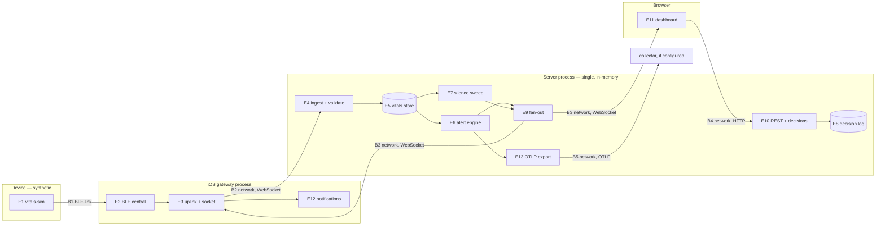

# Data-flow diagram

Maekbeat is not a medical device and there is no manufacturer here. Read
[../regulatory/README.md](../regulatory/README.md) first — it states the position
this file depends on, and it governs this directory too: not a medical device,
no manufacturer, every vital synthetic.

This draws what the data actually does in this repository, where it crosses a
boundary, and what authenticates it when it does. It exists to be consumed by
the STRIDE model that follows it: a threat model built without one produces
categories nobody can argue with, because nothing says where the attack surface
is.

## Why this is not `docs/ARCHITECTURE.md`'s diagram

That file's flowchart carries a queue and an S3 archive, and **neither exists in
this repository — which that file already says.** Its scaling chain has Dev form
and Target form columns, and the table directly beneath the diagram records the
queue as "ring buffer shipped — C6; SQS is target architecture, no commit
assigned, and infra/cdk omits it deliberately — nothing here produces to a
queue", with the S3 archive marked "planned, no commit assigned". It is drawing
where the system is going, honestly labelled, and it is not out of date.

**The first draft of this section said it was, and that was wrong.** It was
written from the diagram without reading the table under it — the fifth prose
claim about another file this sequence has had to correct, and the first made
inside a commit whose whole subject is diagrams that rot. The correction is
recorded rather than quietly applied, because the interesting part is that
knowing about a failure mode does not prevent committing it.

The two documents answer different questions. `docs/ARCHITECTURE.md` asks how
this scales and where it is heading; a threat model cannot consume that, because
a boundary around an unbuilt component has no attack surface and would fill a
STRIDE table with rows about SQS. This asks only what exists now: one process,
one in-memory store, three client surfaces, and one export that leaves the
process only when an endpoint is configured.

## The elements

Every row cites the path that implements it, and
`scripts/check-dataflow-paths.sh` fails the build when one stops resolving.

<!-- dfd:elements -->

| ID  | Kind            | Implemented at                                           | What it does                                                    |
| --- | --------------- | -------------------------------------------------------- | --------------------------------------------------------------- |
| E1  | external source | `packages/vitals-sim/src`                                | Generates every vital in this repository. There is no sensor    |
| E2  | process         | `apps/ios/MaekbeatKit/Sources/MaekbeatKit/BLE`           | CoreBluetooth central and the link state machine                |
| E3  | process         | `apps/ios/MaekbeatKit/Sources/MaekbeatKit/Transport`     | Uplink queue and the socket to the server                       |
| E4  | process         | `apps/server/src/ingest.ts`                              | Validates each inbound frame against the wire contract          |
| E5  | data store      | `apps/server/src/store.ts`                               | In-memory ring per device. Nothing is written to disk           |
| E6  | process         | `apps/server/src/alerts.ts`                              | Threshold engine with hysteresis and cooldown                   |
| E7  | process         | `apps/server/src/silence.ts`                             | Periodic sweep raising an alarm on absence of data              |
| E8  | data store      | `apps/server/src/acks.ts`                                | Append-only decision log; no update and no delete               |
| E9  | process         | `apps/server/src/stream.ts`                              | Fan-out to dashboard subscribers                                |
| E10 | process         | `apps/server/src/reads.ts`                               | REST reads and the decision route                               |
| E11 | external sink   | `apps/web/src`                                           | Browser dashboard, served as static files by `infra/nginx.conf` |
| E12 | external sink   | `apps/ios/MaekbeatKit/Sources/MaekbeatKit/Notifications` | Local notifications on the caregiver's phone                    |
| E13 | external sink   | `apps/server/src/tracing.ts`                             | OTLP span export, inert unless an endpoint is configured        |
| E14 | contract        | `packages/protocol/src`                                  | The schemas every boundary crossing is validated against        |

<!-- /dfd:elements -->

## The diagram

## Data classification

**Two columns, kept apart on purpose.** The left is what this repository
actually carries. The right is what the same field would be in a deployed
product, and it is **hypothetical throughout** — no such deployment exists, no
population has been defined, and nothing here has ever held data about a person.
Merging the two columns would produce a document labelling synthetic integers as
protected health information, which is the same fabrication as a probability
estimate with no population behind it.

| Field                                                 | What it is here                                                          | What it would be deployed (hypothetical)  |
| ----------------------------------------------------- | ------------------------------------------------------------------------ | ----------------------------------------- |
| `heartRateBpm`, `spo2Pct`, `respirationRpm`, `motion` | Integers and floats from a seeded generator in `packages/vitals-sim/src` | Health data about an identified person    |
| `deviceId`                                            | A caller-chosen string, 1–64 chars, bound to nothing                     | A device identifier linkable to a patient |
| `capturedAtMs`, `seq`                                 | Device clock and a counter, both caller-asserted                         | Same, and evidentially relevant           |
| `actor` on a decision                                 | A caller-asserted string, 1–64 chars, unauthenticated                    | An identified clinician or caregiver      |
| Alert and silence records                             | Derived from the above; no separate input                                | Clinical events with retention duties     |

Nothing in the left column is data about a person, because no person has ever
used this. That is a fact about the deployment, not a property of the schema —
the same code fed a real sensor would carry the right column, and the schema
would not change.

## Trust boundaries, and what authenticates across each

Five crossings, stated as facts about this system.

<!-- dfd:boundaries -->

| ID  | Crossing                          | What authenticates it | Established at               |
| --- | --------------------------------- | --------------------- | ---------------------------- |
| B1  | Sensor to phone, BLE              | Nothing               | `docs/ble-gatt-profile.md`   |
| B2  | Phone to server, WebSocket ingest | Nothing               | `apps/server/src/config.ts`  |
| B3  | Server to client, WebSocket       | Nothing               | `apps/server/src/stream.ts`  |
| B4  | Browser to server, HTTP           | Nothing               | `apps/server/src/reads.ts`   |
| B5  | Server to collector, OTLP         | Nothing asserted here | `apps/server/src/tracing.ts` |

<!-- /dfd:boundaries -->

**Nothing authenticates across any boundary in this system, and that is the
finding rather than an omission to apologise for.** It is already recorded in
the code rather than discovered here: `apps/server/src/config.ts` says the
server is unauthenticated and holds only synthetic data, and
`apps/server/src/reads.ts` marks the decision `actor` as asserted by the caller
and names C22 as the row that owns it. `docs/ble-gatt-profile.md` defers pairing,
bonding and encryption to the same row, on the grounds that specifying a
security model with no implementation would be a claim about capability that
does not exist.

Two consequences that make the next commit's threat model have content:

- **Every identity in this system is a string somebody chose.** `deviceId` on a
  frame and `actor` on a decision are both caller-asserted and validated only
  for length. Any client may claim any device and any actor.
- **CORS is not authentication.** `@fastify/cors` restricts which origins a
  browser will let script read a response from; it constrains a browser, not a
  client. Anything that is not a browser ignores it entirely.

## What the guard checks, and what it does not

`scripts/check-dataflow-paths.sh` asserts that every path in the two tables
above resolves to something that exists, and that neither table is empty.

**It catches a renamed or deleted module.** If `apps/server/src/silence.ts`
moves, E7 stops resolving and the build fails — which is the failure mode a
diagram suffers first and shows least, because a box with a stale label renders
exactly like a correct one.

**It does not catch a diagram that describes the wrong flow through a file that
still exists.** If E6 were drawn writing to E8, or a boundary were drawn in the
wrong place, every path would resolve and the guard would pass. Whether the
arrows are true stays human, the same way `scripts/check-hazard-tests.sh` checks
that a citation resolves and leaves the adequacy of the control to a reader.

**Why it is scoped to these two tables and not to prose.** The general version
was tried before this was written: asserting that every backticked path-shaped
token in `docs/regulatory/` resolves produces 22 failures out of 100 citations,
and almost none is an error. `.swift` and `.md` appear as nouns, `/ship-check`
is a slash command, `actions/cache` and `grafana/k6` are SOUP identifiers,
`webstore.iec.ch/en/publication/22794` is a URL, and
`apps/ios/.../BLE/LinkState.swift` is deliberately elided. A guard failing 22
times on its first run is a guard somebody deletes, so the assertion is made
where a path is a path by declaration — inside a marked table — rather than
inferred from shape.
